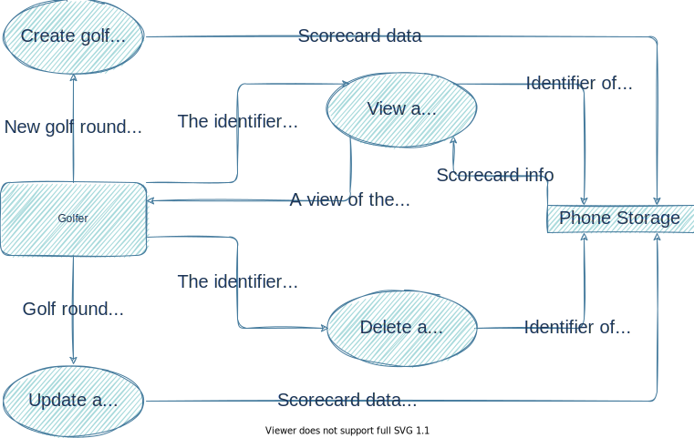

# Software Requirement Specification - Version 1

## Table of Contents

- [Software Requirement Specification - Version 1](#software-requirement-specification---version-1)
  - [Table of Contents](#table-of-contents)
  - [Purpose](#purpose)
  - [Scope](#scope)
  - [Overview](#overview)
  - [Use Cases](#use-cases)
  - [Design](#design)
  - [Tech Stack](#tech-stack)
  - [Future Bells and Whistles](#future-bells-and-whistles)

## Purpose

This document contains the requirements and use cases for the golf scorecard application.

## Scope

This document includes only the information for version 1 of the application. Later versions will
contain their own SRS documents.

## Overview

The golf scorecard application provides a simple cross platform solution for tracking scores of
stroke play golf matches for any golf variation such as normal golf or something like disc golf. A
lot of scorecard applications are overly complicated and include features that many users may not
desire. This variation aims to offer a simpler solution that more closely imitates a physical
scorecard but with the added benefit of saving sessions virtually rather than collecting a stack of
physical cards.

## Use Cases

- As a golfer, I want to virtually track my stroke play golf matches via an app on my phone.
- As a golfer, I want this app to let me track the other golfers in my group as well.
- As a golfer, I want this tracking to let me specify golf match details such as the type of golf
  I'm playing, the course name, how many holes are played, and the par of each hole.
- As a golfer, I want to be able to see previous scorecards.
- As a golfer, I want to be able to share my match results with friends.

## Design

## Tech Stack

- [.NET MAUI](https://docs.microsoft.com/dotnet/maui/)
- [Blazor](https://docs.microsoft.com/aspnet/core/blazor/?view=aspnetcore-6.0)
- [C#](https://docs.microsoft.com/dotnet/csharp/)

## Future Bells and Whistles

- Easily identify the winner in the previous rounds view.
  - Consider something like highlighting the name or adding an icon such as a crown.
- Add ways to sort/filter previous rounds to allow a user to easily find best/worst rounds or any
  other combination of attributes.
